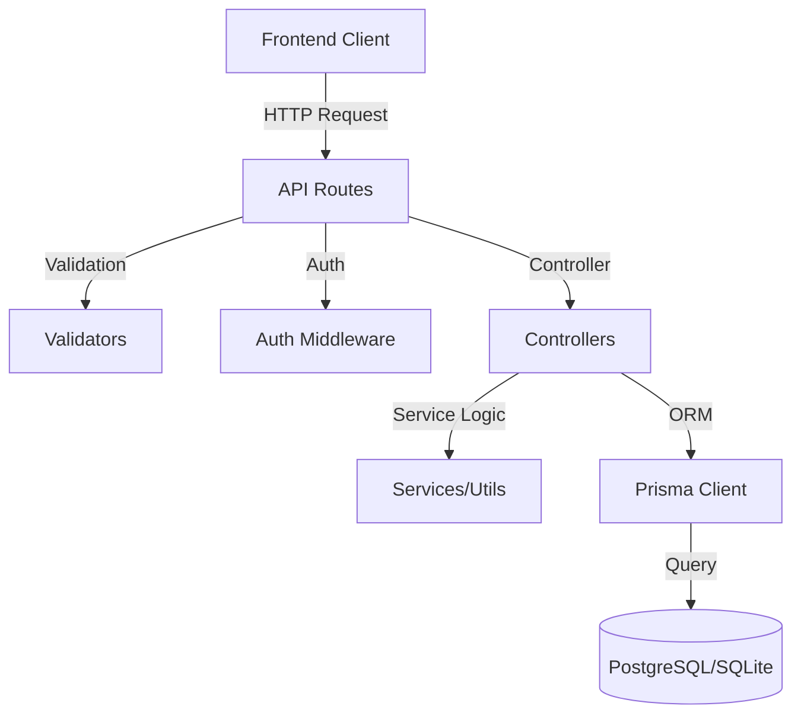

# GearGuard Backend API

This repository contains the backend API for the GearGuard Maintenance Management System. It is built using Node.js, Express, and utilizes Prisma ORM for database management.

## 🏗 Architecture Overview

The backend follows a layered architecture to separate concerns and ensure maintainability:



### Key Components

*   **Controllers (`src/controllers`)**: Handle incoming HTTP requests, execute business logic, and send responses.
*   **Routes (`src/routes`)**: Define API endpoints and map them to controller functions.
*   **Middleware (`src/middlewares`)**: Handle cross-cutting concerns like authentication, error handling, and file uploads.
*   **Prisma (`prisma/`)**: ORM configuration and database schema definitions.
*   **Validators (`src/validators`)**: Request data validation using Zod.

## 🛠 Tech Stack

*   **Runtime**: [Node.js](https://nodejs.org/)
*   **Framework**: [Express.js](https://expressjs.com/)
*   **Database ORM**: [Prisma](https://www.prisma.io/)
*   **Database**: PostgreSQL (Production) / SQLite (Development)
*   **Validation**: [Zod](https://zod.dev/)
*   **Security**: bcrypt, jsonwebtoken, helmet, cors
*   **Logging**: Morgan, Winston (optional)

## 🗄 Database Schema

The core entities in the system are:

*   **User**: System users with Roles (ADMIN, MANAGER, TECHNICIAN, USER).
*   **Equipment**: Machinery and assets being tracked.
*   **MaintenanceRequest**: Service requests for equipment issues.
*   **WorkCenter**: Locations/Departments where equipment is located.
*   **Category**: Classification for equipment.
*   **Team**: Groups of technicians (for future expansion).

### Core Relationships
*   Users belong to a Company.
*   Equipment belongs to a Work Center and Category.
*   Maintenance Requests are linked to Equipment and a User (Requester).
*   Technicians are assigned to Maintenance Requests.

## 🚀 API Routes

### Authentication
*   `POST /api/auth/register` - Register a new user
*   `POST /api/auth/login` - Login and receive JWT
*   `GET /api/auth/me` - Get current user profile

### Equipment
*   `GET /api/equipment` - List all equipment
*   `POST /api/equipment` - Create new equipment
*   `GET /api/equipment/:id` - Get equipment details
*   `PATCH /api/equipment/:id` - Update equipment
*   `DELETE /api/equipment/:id` - Delete equipment

### Maintenance Requests
*   `GET /api/requests` - List requests (filterable)
*   `POST /api/requests` - Create a new request
*   `GET /api/requests/:id` - Get request details
*   `PATCH /api/requests/:id/status` - Update request status
*   `PATCH /api/requests/:id/assign` - Assign technician

### Admin Resources
*   `GET /api/users` - Manage users
*   `GET /api/work-centers` - Manage work centers
*   `GET /api/categories` - Manage categories

## 🔧 Setup & Installation

1.  **Install Dependencies**:
    ```bash
    npm install
    ```

2.  **Environment Variables**:
    Create a `.env` file based on `.env.example`:
    ```env
    DATABASE_URL="file:./dev.db"
    JWT_SECRET="your_jwt_secret"
    PORT=3000
    ```

3.  **Database Migration**:
    ```bash
    npx prisma migrate dev --name init
    ```

4.  **Seed Database (Optional)**:
    ```bash
    npx prisma db seed
    ```

5.  **Run Development Server**:
    ```bash
    npm run dev
    ```

## 🔐 Security

*   **JWT Authentication**: All protected routes require a valid Bearer token.
*   **Role-Based Access Control (RBAC)**: Middleware ensures users only access resources permitted by their role.
*   **Input Validation**: Zod schemas prevent injection and ensure data integrity.
