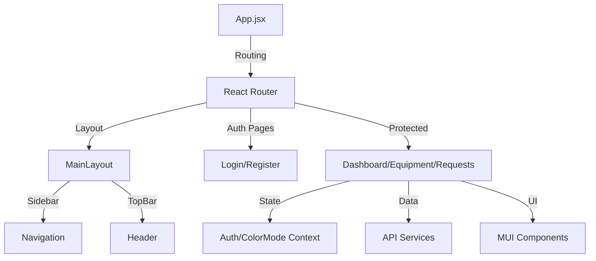

# GearGuard Frontend Client

This repository contains the frontend application for the GearGuard Maintenance Management System. It is a modern Single Page Application (SPA) built with React, Vite, and Material-UI.

## 🏗 Architecture Overview

The frontend is structured to ensure modularity, reusability, and ease of navigation:



### Key Directories

*   **`src/pages`**: View components representing separate routes (Dashboard, Equipment, etc.).
*   **`src/components`**: Reusable UI blocks (Layout, Forms, Tables).
*   **`src/contexts`**: Global state management (AuthContext, ColorModeContext).
*   **`src/services`**: API integration modules (Axios setup).
*   **`src/hooks`**: Custom React hooks.
*   **`src/theme.js`**: Material-UI theme configuration (Light/Dark mode).

## 🛠 Tech Stack

*   **Framework**: [React](https://react.dev/) + [Vite](https://vitejs.dev/)
*   **UI Library**: [Material-UI (MUI v5)](https://mui.com/)
*   **Routing**: [React Router v6](https://reactrouter.com/)
*   **Data Fetching**: [Axios](https://axios-http.com/)
*   **Forms**: [React Hook Form](https://react-hook-form.com/) + [Zod](https://zod.dev/)
*   **Charts**: [Recharts](https://recharts.org/)
*   **Calendar**: [FullCalendar](https://fullcalendar.io/)
*   **Date Handling**: [Day.js](https://day.js.org/)

## ✨ Key Features

1.  **Role-Based Access Control**: UI elements adapt based on user role (USER, TECHNICIAN, MANAGER, ADMIN).
2.  **Dark Mode**: System-wide dark mode support with persisted preference.
3.  **Responsive Design**: Fully collapsible sidebar and mobile-friendly layout.
4.  **Interactive Dashboard**: Real-time stats, charts, and activity feeds.
5.  **Kanban Board**: Drag-and-drop interface for managing maintenance requests.
6.  **Calendar Integration**: Visual scheduler for preventive maintenance.

## 🎨 Theme System

The application uses a custom MUI theme defined in `src/theme.js`. It supports dynamic switching between light and dark modes via the `ColorModeContext`.

*   **Primary Color**: `#667eea` (Light Blue/Purple)
*   **Border Radius**: Reduced to `6px` for a professional, modern look.
*   **Typography**: Inter font family for clean readability.

## 🚀 Getting Started

1.  **Install Dependencies**:
    ```bash
    npm install
    ```

2.  **Configure Environment**:
    Ensure the backend API is running on `http://localhost:3000` (or configure via `.env`).

3.  **Run Development Server**:
    ```bash
    npm run dev
    ```

4.  **Build for Production**:
    ```bash
    npm run build
    ```
